# DevOps Brain - Complete Architecture & Design Documentation

**Version:** 2.1.0  
**Last Updated:** December 2024  
**Status:** Production Ready  
**Prepared for:** mgx.dev Cloud Review

---

## 📋 Table of Contents

1. [Executive Summary](#executive-summary)
2. [System Overview](#system-overview)
3. [Architecture Diagrams](#architecture-diagrams)
4. [Component Tree Structure](#component-tree-structure)
5. [Design Decisions](#design-decisions)
6. [Technology Stack](#technology-stack)
7. [Data Flow](#data-flow)
8. [Deployment Architecture](#deployment-architecture)
9. [Enhancement Features](#enhancement-features)
10. [Security Architecture](#security-architecture)
11. [Observability](#observability)
12. [Scalability & Performance](#scalability--performance)

---

## Executive Summary

DevOps Brain is a comprehensive AI-powered DevOps automation platform that orchestrates specialist AI agents to automate development, operations, and infrastructure tasks. The system features:

- **11 Specialist AI Agents** for different domains (security, testing, documentation, performance, etc.)
- **Multi-LLM Support** with Gemini 3 Pro as primary, OpenAI/Anthropic as fallbacks
- **Workflow Engine** with DAG-based execution, scheduling, and webhooks
- **Unified MCP Adapters** for GitHub, Slack, Figma, databases, and monitoring
- **Enhanced Reliability** with circuit breakers, deduplication, and load balancing
- **Cost Tracking** for LLM usage with budget enforcement
- **Distributed Tracing** and comprehensive metrics
- **Memory System** with persistence and semantic search
- **Design System** with Figma integration

---

## System Overview

### High-Level Architecture

```mermaid
graph TB
    subgraph "Client Layer"
        CLI[CLI Tool]
        API[REST API]
        WS[WebSocket]
        Frontend[Next.js Frontend]
    end
    
    subgraph "API Gateway"
        FastAPI[FastAPI Application]
        Auth[JWT Auth]
        RateLimit[Rate Limiter]
        Middleware[Middleware]
    end
    
    subgraph "Core Orchestration"
        Orchestrator[Orchestrator]
        CircuitBreaker[Circuit Breaker]
        Deduplicator[Task Deduplicator]
        LoadBalancer[Load Balancer]
        MessageQueue[Priority Message Queue]
    end
    
    subgraph "AI Agents"
        RootAgent[Root Agent]
        SecurityAgent[Security Agent]
        TestingAgent[Testing Agent]
        DocsAgent[Documentation Agent]
        PerfAgent[Performance Agent]
        IncidentAgent[Incident Response]
        DBAgent[Database Agent]
        InfraAgent[Infrastructure Agent]
        DesignAgent[Design Agent]
    end
    
    subgraph "LLM Layer"
        LLMManager[LLM Manager]
        GeminiProvider[Gemini 3 Pro]
        OpenAIProvider[OpenAI]
        AnthropicProvider[Anthropic]
        CostTracker[Cost Tracker]
        Cache[Response Cache]
    end
    
    subgraph "Memory System"
        MemoryManager[Memory Manager]
        ConversationMem[Conversation Memory]
        VectorMem[Vector Memory]
        Persistence[Memory Persistence]
    end
    
    subgraph "Workflow Engine"
        WorkflowEngine[Workflow Engine]
        Scheduler[Cron Scheduler]
        Webhooks[Webhook Manager]
        Checkpoints[Checkpoint Manager]
        Templates[Workflow Templates]
    end
    
    subgraph "MCP Adapters"
        MCPManager[MCP Manager]
        GitHubAdapter[GitHub]
        SlackAdapter[Slack]
        FigmaAdapter[Figma]
        DBAdapter[Database]
        MonitorAdapter[Monitoring]
    end
    
    subgraph "Observability"
        Tracing[OpenTelemetry Tracing]
        Metrics[Prometheus Metrics]
        Logging[Structured Logging]
    end
    
    subgraph "Storage"
        PostgreSQL[(PostgreSQL)]
        Redis[(Redis)]
        VectorDB[(Vector DB)]
    end
    
    CLI --> FastAPI
    API --> FastAPI
    WS --> FastAPI
    Frontend --> FastAPI
    
    FastAPI --> Auth
    FastAPI --> RateLimit
    FastAPI --> Middleware
    FastAPI --> Orchestrator
    
    Orchestrator --> CircuitBreaker
    Orchestrator --> Deduplicator
    Orchestrator --> LoadBalancer
    Orchestrator --> MessageQueue
    
    Orchestrator --> RootAgent
    Orchestrator --> SecurityAgent
    Orchestrator --> TestingAgent
    Orchestrator --> DocsAgent
    Orchestrator --> PerfAgent
    Orchestrator --> IncidentAgent
    Orchestrator --> DBAgent
    Orchestrator --> InfraAgent
    Orchestrator --> DesignAgent
    
    RootAgent --> LLMManager
    SecurityAgent --> LLMManager
    TestingAgent --> LLMManager
    DocsAgent --> LLMManager
    
    LLMManager --> GeminiProvider
    LLMManager --> OpenAIProvider
    LLMManager --> AnthropicProvider
    LLMManager --> CostTracker
    LLMManager --> Cache
    
    RootAgent --> MemoryManager
    SecurityAgent --> MemoryManager
    
    MemoryManager --> ConversationMem
    MemoryManager --> VectorMem
    MemoryManager --> Persistence
    
    Orchestrator --> WorkflowEngine
    WorkflowEngine --> Scheduler
    WorkflowEngine --> Webhooks
    WorkflowEngine --> Checkpoints
    WorkflowEngine --> Templates
    
    RootAgent --> MCPManager
    SecurityAgent --> MCPManager
    InfraAgent --> MCPManager
    
    MCPManager --> GitHubAdapter
    MCPManager --> SlackAdapter
    MCPManager --> FigmaAdapter
    MCPManager --> DBAdapter
    MCPManager --> MonitorAdapter
    
    FastAPI --> Tracing
    Orchestrator --> Metrics
    All[All Components] --> Logging
    
    Persistence --> PostgreSQL
    Cache --> Redis
    VectorMem --> VectorDB
    MessageQueue --> Redis
```

---

## Architecture Diagrams

### 1. System Architecture

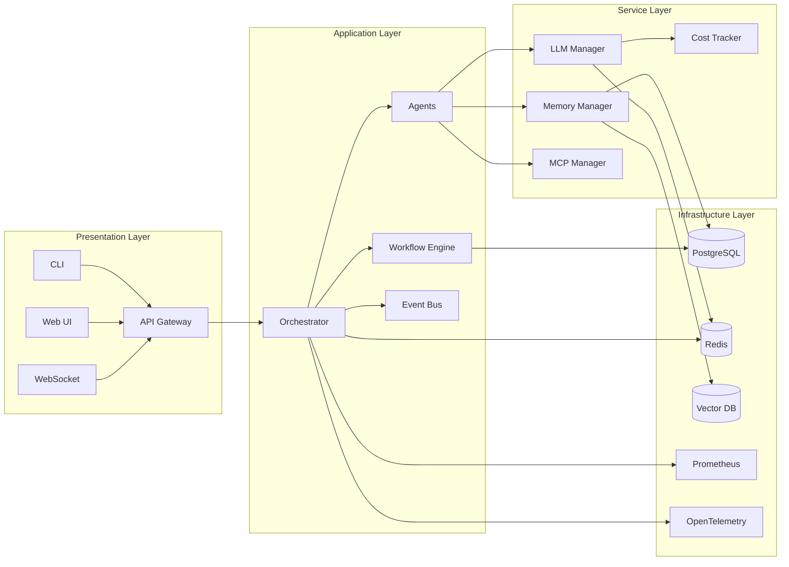

### 2. Agent Orchestration Flow

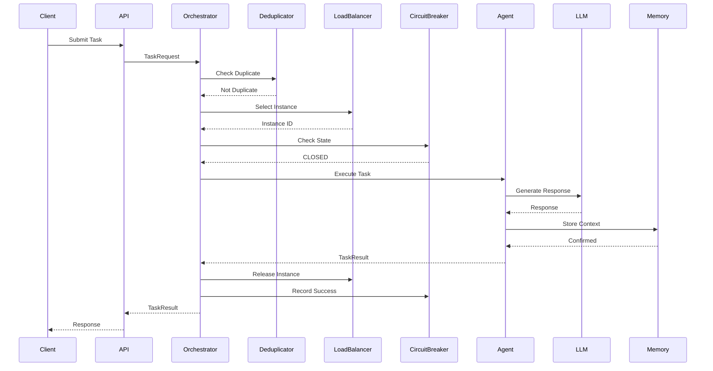

### 3. LLM Integration Flow

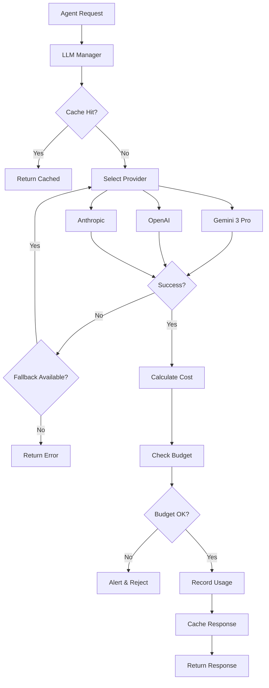

### 4. Workflow Execution Flow

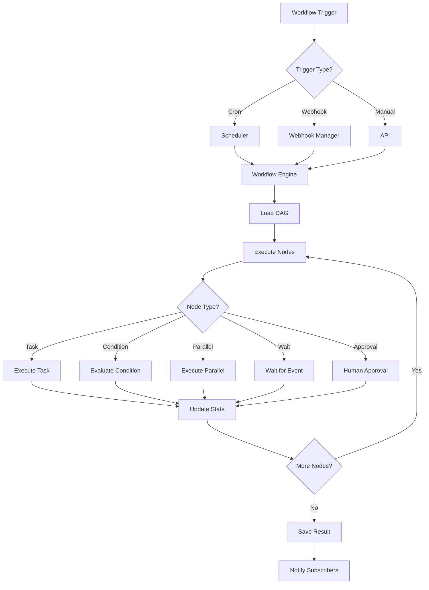

### 5. Memory System Architecture

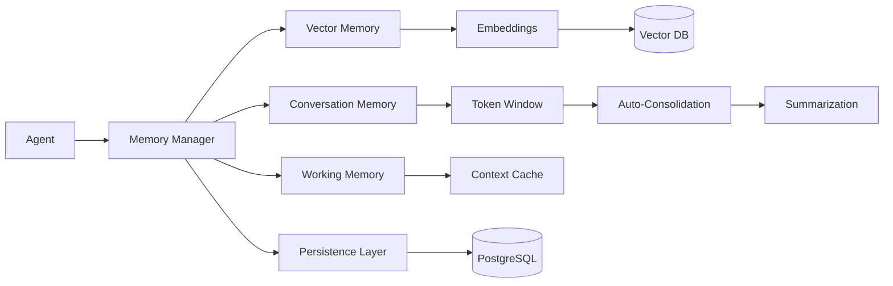

### 6. Enhanced Features Architecture

```mermaid
graph TB
    subgraph "Reliability"
        A[Circuit Breaker]
        B[Task Deduplication]
        C[Retry Logic]
    end
    
    subgraph "Performance"
        D[Load Balancer]
        E[Response Cache]
        F[Connection Pooling]
    end
    
    subgraph "Observability"
        G[Distributed Tracing]
        H[Prometheus Metrics]
        I[Structured Logging]
    end
    
    subgraph "Cost Control"
        J[Cost Tracker]
        K[Budget Enforcement]
        L[Usage Analytics]
    end
    
    subgraph "Durability"
        M[Memory Persistence]
        N[Task Result Storage]
        O[Checkpointing]
    end
    
    Orchestrator --> A
    Orchestrator --> B
    Orchestrator --> D
    Orchestrator --> G
    Orchestrator --> H
    
    LLMManager --> J
    LLMManager --> K
    LLMManager --> E
    
    MemoryManager --> M
    WorkflowEngine --> O
```

---

## Component Tree Structure

```
devops-brain/
│
├── 📁 agents/                          # AI Agent System
│   ├── 📁 specialists/                # Agent Implementations
│   │   ├── base_agent.py              # Base agent class
│   │   ├── root_agent.py              # Root orchestrator agent
│   │   ├── security_agent.py          # Security scanning & compliance
│   │   ├── testing_agent.py            # Test generation & execution
│   │   ├── documentation_agent.py      # Docs generation
│   │   ├── performance_agent.py        # Performance optimization
│   │   ├── incident_response_agent.py  # Incident handling
│   │   ├── database_agent.py          # Database operations
│   │   ├── infrastructure_agent.py    # Infrastructure management
│   │   └── design_agent.py            # Design system & Figma
│   ├── 📁 prompts/                     # System prompts (Markdown)
│   │   ├── root_agent.md
│   │   ├── security_agent.md
│   │   ├── testing_agent.md
│   │   ├── documentation_agent.md
│   │   ├── incident_response_agent.md
│   │   └── design_agent.md
│   └── agent_config.yaml              # Agent registry & config
│
├── 📁 src/                             # Source Code
│   ├── 📁 api/                         # FastAPI Application
│   │   ├── main.py                     # FastAPI app & lifespan
│   │   ├── websocket.py                # WebSocket handler
│   │   └── 📁 routes/                  # API Route Handlers
│   │       ├── agents.py               # Agent endpoints
│   │       ├── tasks.py                # Task endpoints
│   │       ├── health.py                # Health checks
│   │       ├── design.py               # Design system API
│   │       └── workflows.py            # Workflow management
│   │
│   ├── 📁 cli/                         # CLI Application
│   │   └── main.py                     # Typer CLI commands
│   │
│   ├── 📁 core/                        # Core Components
│   │   ├── orchestrator.py             # Main orchestrator
│   │   ├── message_queue.py            # Priority message queue
│   │   │
│   │   ├── 📁 orchestrator/             # Orchestrator Enhancements
│   │   │   ├── circuit_breaker.py      # Circuit breaker pattern
│   │   │   ├── task_deduplication.py   # Task deduplication
│   │   │   └── load_balancer.py         # Agent load balancing
│   │   │
│   │   ├── 📁 llm/                     # LLM Integration
│   │   │   ├── base.py                 # Base LLM interface
│   │   │   ├── providers.py            # Provider implementations
│   │   │   ├── manager.py              # LLM manager with fallback
│   │   │   └── cost_tracker.py         # Cost tracking & budgeting
│   │   │
│   │   ├── 📁 memory/                   # Memory System
│   │   │   ├── base.py                 # Memory base classes
│   │   │   ├── conversation.py        # Conversation memory
│   │   │   ├── vector.py               # Vector/semantic memory
│   │   │   ├── manager.py              # Memory manager
│   │   │   └── persistence.py         # Memory persistence
│   │   │
│   │   ├── 📁 workflow/                 # Workflow Engine
│   │   │   ├── dag.py                  # DAG data structure
│   │   │   ├── executor.py             # Workflow executor
│   │   │   ├── engine.py               # Workflow engine
│   │   │   ├── scheduler.py            # Cron scheduler
│   │   │   ├── webhooks.py             # Webhook triggers
│   │   │   ├── persistence.py         # Workflow storage
│   │   │   ├── checkpointing.py       # Checkpoint system
│   │   │   ├── nodes.py                # Special node types
│   │   │   └── templates.py            # Workflow templates
│   │   │
│   │   ├── 📁 auth/                     # Authentication
│   │   │   ├── jwt_auth.py             # JWT authentication
│   │   │   ├── rate_limiter.py         # Rate limiting
│   │   │   └── middleware.py          # Auth middleware
│   │   │
│   │   ├── 📁 events/                   # Event System
│   │   │   ├── bus.py                  # Event bus (pub/sub)
│   │   │   └── types.py                # Event types
│   │   │
│   │   └── 📁 observability/            # Observability
│   │       ├── tracing.py              # OpenTelemetry tracing
│   │       └── metrics.py              # Prometheus metrics
│   │
│   ├── 📁 ui/                           # UI Component Library
│   │   ├── 📁 components/              # React Components
│   │   │   ├── Button.tsx
│   │   │   ├── Input.tsx
│   │   │   ├── Card.tsx
│   │   │   ├── Modal.tsx
│   │   │   ├── Navbar.tsx
│   │   │   ├── 📁 feedback/
│   │   │   │   ├── Alert.tsx
│   │   │   │   ├── Badge.tsx
│   │   │   │   └── Spinner.tsx
│   │   │   └── 📁 utils/
│   │   │       └── cn.ts
│   │   └── 📁 pages/                    # Page Templates
│   │       └── DashboardPage.tsx
│   │
│   └── 📁 styles/                       # Design System
│       └── tokens.css                  # CSS Design Tokens (377 vars)
│
├── 📁 mcp/                              # Unified MCP Adapters
│   ├── mcp_manager.py                   # Central MCP manager
│   ├── mcp_config.yaml                  # MCP configuration
│   └── 📁 adapters/                     # MCP Adapter Implementations
│       ├── base_adapter.py              # Base adapter interface
│       ├── github_adapter.py            # GitHub integration
│       ├── slack_adapter.py             # Slack integration
│       ├── figma_adapter.py             # Figma integration
│       ├── database_adapter.py          # Database adapter
│       └── monitoring_adapter.py        # Monitoring adapter
│
├── 📁 sdk/                              # Python SDK
│   ├── client.py                        # Async API client
│   ├── agents.py                        # Agent operations
│   ├── tasks.py                         # Task operations
│   └── exceptions.py                   # SDK exceptions
│
├── 📁 frontend/                         # Next.js Frontend
│   ├── 📁 src/
│   │   ├── 📁 app/                      # Next.js App Router
│   │   │   ├── (dashboard)/            # Dashboard routes
│   │   │   │   ├── dashboard/
│   │   │   │   ├── agents/
│   │   │   │   ├── tasks/
│   │   │   │   ├── design/
│   │   │   │   └── settings/
│   │   │   ├── layout.tsx
│   │   │   └── page.tsx
│   │   ├── 📁 components/               # React Components
│   │   │   ├── layout/
│   │   │   └── ui/
│   │   ├── 📁 hooks/                    # React Hooks
│   │   │   └── useWebSocket.ts
│   │   ├── 📁 lib/                      # Utilities
│   │   │   ├── api.ts
│   │   │   └── utils.ts
│   │   └── 📁 store/                    # Zustand State
│   │       └── index.ts
│   ├── package.json
│   ├── next.config.js
│   └── tailwind.config.ts
│
├── 📁 tests/                            # Test Suite
│   ├── 📁 agents/                       # Agent tests
│   ├── 📁 adapters/                     # Adapter tests
│   ├── 📁 api/                          # API tests
│   └── conftest.py                      # Pytest fixtures
│
├── 📁 workflows/                         # Workflow Definitions
│   ├── ci_workflow.yaml
│   ├── deploy_workflow.yaml
│   └── pr_workflow.yaml
│
├── 📁 docker/                           # Docker & Kubernetes
│   ├── Dockerfile                       # Multi-stage build
│   ├── docker-compose.yml               # Local development
│   └── 📁 kubernetes/                   # K8s Manifests
│       ├── namespace.yaml
│       ├── deployment.yaml
│       ├── service.yaml
│       ├── ingress.yaml
│       ├── hpa.yaml                     # Horizontal Pod Autoscaler
│       ├── pdb.yaml                     # Pod Disruption Budget
│       ├── configmap.yaml
│       ├── secret.yaml
│       └── serviceaccount.yaml
│   └── 📁 postgres/
│       └── init.sql
│   └── 📁 prometheus/
│       └── prometheus.yml
│
├── 📁 .github/workflows/                # CI/CD Pipelines
│   ├── ci.yml                           # Continuous Integration
│   └── pr-check.yml                     # PR Validation
│
├── 📁 scripts/                          # Utility Scripts
│   ├── setup.sh                         # Setup script
│   └── test_gemini.py                   # Gemini testing
│
├── 📁 config/                           # Configuration
│   └── settings.yaml
│
├── 📄 Documentation Files
│   ├── README.md                        # Main README
│   ├── PROJECT_STATUS.md                # Project status
│   ├── ARCHITECTURE.md                  # This file
│   ├── DEEP_ANALYSIS.md                 # Component analysis
│   ├── ENHANCEMENTS_APPLIED.md          # Enhancement details
│   ├── IMPLEMENTATION_SUMMARY.md        # Implementation summary
│   ├── GEMINI_INTEGRATION.md            # Gemini 3 Pro docs
│   ├── WORKFLOW_SYSTEM.md               # Workflow system docs
│   └── LANGGRAPH_ANALYSIS.md            # LangGraph comparison
│
├── requirements.txt                     # Python dependencies
├── package.json                         # Frontend dependencies
└── tailwind.config.js                   # Tailwind config
```

---

## Design Decisions

### 1. **Multi-LLM Architecture**
- **Decision**: Support multiple LLM providers with automatic fallback
- **Rationale**: Redundancy, cost optimization, provider-specific features
- **Implementation**: LLM Manager with provider abstraction

### 2. **Circuit Breaker Pattern**
- **Decision**: Implement circuit breakers for all agent calls
- **Rationale**: Prevent cascade failures, improve resilience
- **Implementation**: Per-agent circuit breakers with configurable thresholds

### 3. **Task Deduplication**
- **Decision**: Hash-based task deduplication
- **Rationale**: Prevent redundant work, save resources
- **Implementation**: Signature-based matching with TTL

### 4. **Event-Driven Architecture**
- **Decision**: Pub/sub event bus for loose coupling
- **Rationale**: Scalability, extensibility, decoupling
- **Implementation**: Async event bus with history and dead letter queue

### 5. **Memory Persistence**
- **Decision**: Persist memories to database
- **Rationale**: Durability, context preservation across restarts
- **Implementation**: Background batch persistence with consolidation

### 6. **Workflow Engine**
- **Decision**: DAG-based workflows with scheduling
- **Rationale**: Complex automation, reusable patterns
- **Implementation**: DAG execution with cron scheduling and webhooks

### 7. **Cost Tracking**
- **Decision**: Track and budget LLM costs
- **Rationale**: Cost control, budget management
- **Implementation**: Per-provider cost calculation with budget enforcement

### 8. **Observability First**
- **Decision**: Comprehensive tracing and metrics
- **Rationale**: Debugging, monitoring, performance analysis
- **Implementation**: OpenTelemetry + Prometheus

---

## Technology Stack

### Backend
- **Python 3.11+**
- **FastAPI** - Web framework
- **Pydantic** - Data validation
- **Uvicorn** - ASGI server
- **Typer** - CLI framework
- **Rich** - CLI formatting

### AI/ML
- **Google Gemini 3 Pro** (Primary LLM)
- **OpenAI GPT-4** (Fallback)
- **Anthropic Claude** (Fallback)
- **Sentence Transformers** - Embeddings
- **ChromaDB/FAISS** - Vector storage

### Data Storage
- **PostgreSQL** - Primary database
- **Redis** - Caching & message queue
- **Vector DB** - Semantic search

### Observability
- **OpenTelemetry** - Distributed tracing
- **Prometheus** - Metrics collection
- **Structlog** - Structured logging

### Frontend
- **Next.js 14** - React framework
- **TypeScript** - Type safety
- **Tailwind CSS** - Styling
- **Zustand** - State management
- **SWR** - Data fetching
- **WebSocket** - Real-time updates

### Infrastructure
- **Docker** - Containerization
- **Kubernetes** - Orchestration
- **Nginx** - Reverse proxy
- **Prometheus** - Monitoring

### Development
- **Ruff** - Linting & formatting
- **Mypy** - Type checking
- **Pytest** - Testing
- **Bandit** - Security scanning

---

## Data Flow

### Request Flow

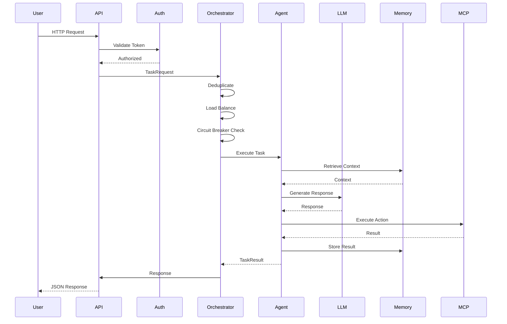

### Cost Tracking Flow

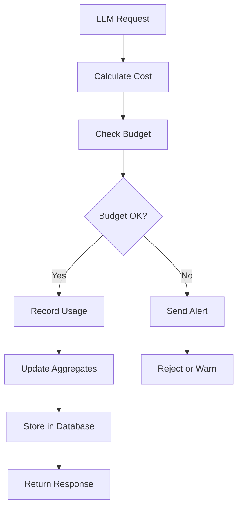

---

## Deployment Architecture

### Kubernetes Deployment

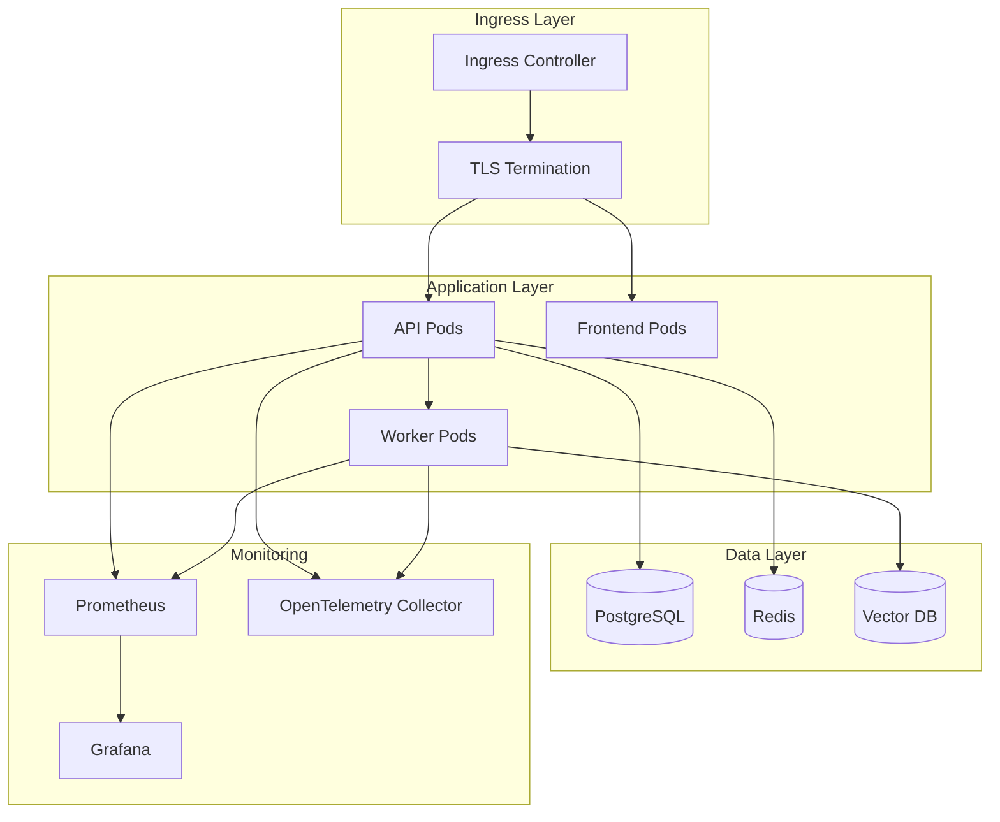

### Scalability

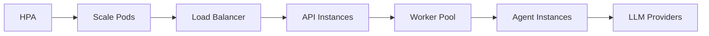

---

## Enhancement Features

### 1. Circuit Breaker
- **Purpose**: Prevent cascade failures
- **States**: CLOSED → OPEN → HALF_OPEN
- **Config**: Failure threshold, timeout, success threshold

### 2. Task Deduplication
- **Method**: Hash-based signature matching
- **TTL**: Configurable expiration
- **Impact**: Reduces redundant work

### 3. Load Balancing
- **Strategies**: Round-robin, least-connections, random, weighted
- **Health-aware**: Routes to healthy instances
- **Impact**: Better resource utilization

### 4. Cost Tracking
- **Features**: Per-provider tracking, budget enforcement, alerts
- **Metrics**: Daily, monthly, per-user costs
- **Impact**: Cost visibility and control

### 5. Memory Persistence
- **Method**: Background batch persistence
- **Storage**: PostgreSQL
- **Impact**: Memories survive restarts

### 6. Distributed Tracing
- **Tool**: OpenTelemetry
- **Features**: Span-based tracing, attribute tracking
- **Impact**: End-to-end request tracking

### 7. Enhanced Metrics
- **Tool**: Prometheus
- **Types**: Counters, histograms, gauges
- **Impact**: Comprehensive monitoring

---

## Security Architecture

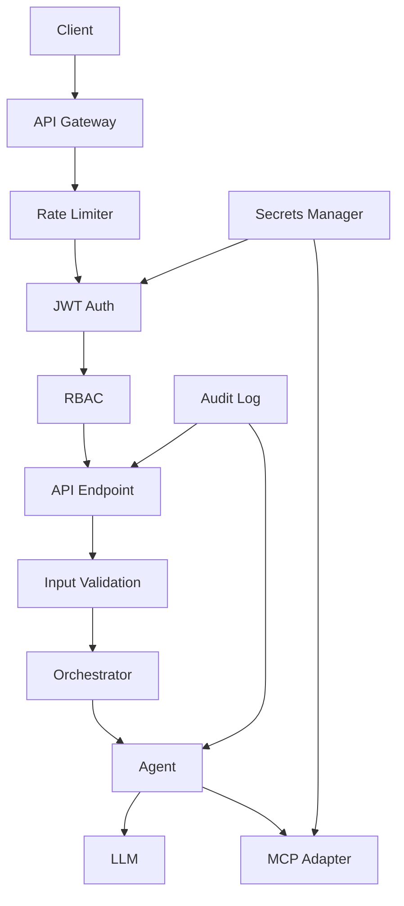

### Security Features
- JWT authentication with refresh tokens
- Role-based access control (RBAC)
- Rate limiting (token bucket + sliding window)
- Input validation (Pydantic)
- Secret management
- Audit logging
- HTTPS/TLS enforcement

---

## Observability

### Metrics
- Task execution metrics
- LLM usage and costs
- Agent performance
- Queue sizes
- Error rates
- Latency percentiles

### Tracing
- Request tracing across services
- Span attributes
- Error tracking
- Performance profiling

### Logging
- Structured JSON logging
- Log levels (DEBUG, INFO, WARNING, ERROR)
- Contextual information
- Correlation IDs

---

## Scalability & Performance

### Horizontal Scaling
- Stateless API design
- Kubernetes HPA
- Worker pool scaling
- Load balancer distribution

### Caching Strategy
- LLM response caching
- Memory caching
- Redis for hot data
- TTL-based expiration

### Performance Optimizations
- Async/await throughout
- Connection pooling
- Batch operations
- Lazy loading

---

## Questions for mgx.dev Review

1. **Architecture**: Are there any architectural improvements or patterns we should consider?

2. **Scalability**: How can we improve horizontal scaling capabilities?

3. **Cost Optimization**: Any suggestions for further cost reduction?

4. **Security**: Are there additional security measures we should implement?

5. **Observability**: What additional observability features would be valuable?

6. **Performance**: Any performance bottlenecks or optimization opportunities?

7. **Reliability**: How can we further improve system reliability?

8. **Developer Experience**: What would improve the developer experience?

---

## Conclusion

DevOps Brain is a comprehensive, production-ready platform with:
- ✅ Robust architecture
- ✅ Enhanced reliability features
- ✅ Comprehensive observability
- ✅ Cost control mechanisms
- ✅ Scalable design
- ✅ Security best practices

Ready for production deployment and continuous improvement based on feedback.

---

**Document Version**: 1.0  
**Last Updated**: December 2024  
**Prepared By**: DevOps Brain Team  
**For Review By**: mgx.dev Cloud
