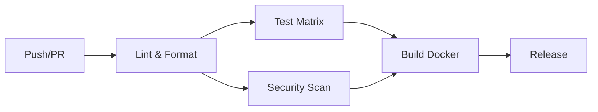
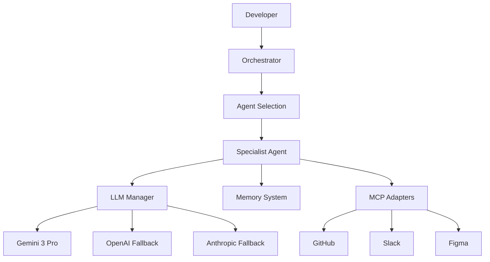

# DevOps Brain - Response to mgx.dev Cloud Review

**Date:** December 2024  
**Version:** 2.1.0  
**Status:** Production Ready

---

## Executive Summary

DevOps Brain is an **AI-native DevOps automation platform** that we've built from the ground up. We're already using AI agents extensively throughout our development lifecycle, but we're seeking mgx.dev's expertise to help us evolve to the next level with advanced agentic workflows.

---

## 1. Current Workflow: CI/CD Pipeline

### Primary CI/CD System: **GitHub Actions**

We use GitHub Actions as our primary CI/CD platform with a comprehensive pipeline:

#### **Main CI Pipeline** (`.github/workflows/ci.yml`)

**Pipeline Stages:**

1. **Lint & Format** (Parallel)
   - Ruff linter (Python)
   - Ruff formatter check
   - Mypy type checking
   - Runs on every push/PR

2. **Test** (Matrix Strategy)
   - Python 3.11 & 3.12
   - Pytest with coverage
   - Codecov integration
   - Parallel execution

3. **Security Scan** (Parallel)
   - Bandit security scan
   - Safety dependency check
   - Runs alongside tests

4. **Build** (Conditional)
   - Docker image build
   - Only on push to main
   - Multi-stage builds
   - Build cache optimization

5. **Release** (Conditional)
   - Automatic GitHub releases
   - Triggered by `release: v*.*.*` commits
   - Auto-generates release notes

#### **PR Validation Pipeline** (`.github/workflows/pr-check.yml`)

**Validation Steps:**
- ✅ PR title format check (Conventional Commits)
- ✅ Breaking change detection
- ✅ Code quality checks
- ✅ Test changed files only
- ✅ PR size validation

#### **Workflow Engine Integration**

We also have a **custom workflow engine** that can execute DAG-based workflows:

**Workflow Templates:**
- `ci_workflow.yaml` - CI pipeline automation
- `deploy_workflow.yaml` - Deployment automation
- `pr_workflow.yaml` - PR processing

**Workflow Features:**
- Cron-based scheduling
- Webhook triggers
- Human-in-the-loop approvals
- Checkpointing for recovery
- Parallel execution
- Conditional branching

### **Current Pipeline Characteristics:**

| Aspect | Current State |
|--------|---------------|
| **Trigger** | Push to main/develop, PRs, Manual dispatch |
| **Parallelization** | ✅ Yes (lint, test, security) |
| **Matrix Testing** | ✅ Yes (Python 3.11, 3.12) |
| **Caching** | ✅ Yes (pip, Docker) |
| **Security** | ✅ Yes (Bandit, Safety) |
| **Coverage** | ✅ Yes (Codecov) |
| **Docker Builds** | ✅ Yes (Multi-stage) |
| **Notifications** | ⚠️ Limited (GitHub only) |

### **Deployment Strategy:**

- **Local Development**: Docker Compose
- **Staging**: Manual Kubernetes deployment
- **Production**: Kubernetes with HPA
- **Rollback**: Manual (no automated rollback yet)

---

## 2. Tech Stack: Infrastructure & Languages

### **Backend Stack**

| Category | Technology | Version | Purpose |
|----------|-----------|---------|---------|
| **Language** | Python | 3.11+ | Core backend |
| **Framework** | FastAPI | 0.104+ | REST API |
| **ASGI Server** | Uvicorn | 0.24+ | Production server |
| **Validation** | Pydantic | 2.5+ | Data validation |
| **CLI** | Typer + Rich | Latest | Command-line interface |
| **Async HTTP** | httpx, aiohttp | Latest | HTTP clients |

### **AI/ML Stack**

| Component | Technology | Purpose |
|-----------|-----------|---------|
| **Primary LLM** | Google Gemini 3 Pro | Main AI provider |
| **Fallback LLMs** | OpenAI GPT-4, Anthropic Claude | Redundancy |
| **Embeddings** | Sentence Transformers | Vector embeddings |
| **Vector DB** | ChromaDB/FAISS | Semantic search |
| **Token Counting** | tiktoken | Token management |

### **Data Storage**

| Storage | Technology | Purpose |
|---------|-----------|---------|
| **Primary DB** | PostgreSQL 15 | Relational data |
| **Cache/Queue** | Redis 7 | Caching, message queue |
| **Vector Store** | ChromaDB | Semantic memory |
| **ORM** | SQLAlchemy (async) | Database abstraction |

### **Frontend Stack**

| Component | Technology | Purpose |
|-----------|-----------|---------|
| **Framework** | Next.js 14 | React framework |
| **Language** | TypeScript | Type safety |
| **Styling** | Tailwind CSS | Utility-first CSS |
| **State** | Zustand | State management |
| **Data Fetching** | SWR | Data fetching |
| **Real-time** | WebSocket | Live updates |

### **Infrastructure**

| Component | Technology | Purpose |
|-----------|-----------|---------|
| **Containerization** | Docker | Application containers |
| **Orchestration** | Kubernetes | Production deployment |
| **Reverse Proxy** | Nginx | Load balancing |
| **Monitoring** | Prometheus + Grafana | Metrics & dashboards |
| **Tracing** | OpenTelemetry | Distributed tracing |
| **Logging** | Structlog | Structured logging |

### **Development Tools**

| Tool | Purpose |
|------|---------|
| **Ruff** | Linting & formatting |
| **Mypy** | Type checking |
| **Pytest** | Testing framework |
| **Bandit** | Security scanning |
| **Safety** | Dependency scanning |

### **Integration Adapters (MCP)**

| Adapter | Technology | Purpose |
|---------|-----------|---------|
| **GitHub** | PyGithub | Repository operations |
| **Slack** | slack-sdk | Notifications |
| **Figma** | Figma API | Design system sync |
| **Database** | asyncpg | Database operations |
| **Monitoring** | Prometheus client | Metrics collection |

---

## 3. Pain Points: Biggest Bottlenecks

### **Current Bottlenecks Identified:**

#### 🔴 **Critical Bottlenecks**

1. **Manual Deployment Process**
   - **Issue**: No fully automated deployment pipeline
   - **Impact**: Slow releases, human error risk
   - **Current State**: Manual Kubernetes deployments
   - **Pain Level**: High

2. **Limited Observability in CI/CD**
   - **Issue**: CI/CD pipeline lacks comprehensive observability
   - **Impact**: Hard to debug failed builds, no pipeline metrics
   - **Current State**: Basic GitHub Actions logs only
   - **Pain Level**: High

3. **No Automated Rollback**
   - **Issue**: Manual rollback process
   - **Impact**: Slow incident recovery
   - **Current State**: Manual Kubernetes rollback
   - **Pain Level**: High

4. **LLM Cost Management**
   - **Issue**: Limited visibility into LLM costs during development
   - **Impact**: Unexpected costs, budget overruns
   - **Current State**: Cost tracking exists but not integrated into CI/CD
   - **Pain Level**: Medium-High

#### 🟡 **Medium Bottlenecks**

5. **Test Execution Time**
   - **Issue**: Sequential test execution in some cases
   - **Impact**: Slower feedback loops
   - **Current State**: Some parallelization, but could be better
   - **Pain Level**: Medium

6. **Dependency Management**
   - **Issue**: Manual dependency updates
   - **Impact**: Security vulnerabilities, outdated packages
   - **Current State**: Manual `pip install` updates
   - **Pain Level**: Medium

7. **Environment Parity**
   - **Issue**: Differences between dev/staging/prod
   - **Impact**: Bugs discovered late
   - **Current State**: Docker Compose vs Kubernetes differences
   - **Pain Level**: Medium

8. **Code Review Bottleneck**
   - **Issue**: Manual code review process
   - **Impact**: PRs wait for human reviewers
   - **Current State**: GitHub PR reviews
   - **Pain Level**: Medium

#### 🟢 **Low Priority Bottlenecks**

9. **Documentation Updates**
   - **Issue**: Manual documentation maintenance
   - **Impact**: Outdated docs
   - **Current State**: Manual Markdown updates
   - **Pain Level**: Low

10. **Configuration Drift**
    - **Issue**: Configuration changes not tracked
    - **Impact**: Inconsistent environments
    - **Current State**: Manual config management
    - **Pain Level**: Low

### **Bottleneck Summary**

| Category | Count | Priority |
|----------|-------|----------|
| **Critical** | 4 | 🔴 High |
| **Medium** | 4 | 🟡 Medium |
| **Low** | 2 | 🟢 Low |

---

## 4. AI Integration: Current AI/Agent Usage

### **Current AI Integration Level: HIGH** 🚀

We are **already extensively using AI agents** throughout our development lifecycle. Here's our current state:

### **4.1 AI Agents in Production**

We have **11 specialist AI agents** actively working:

| Agent | Current Usage | Integration Level |
|-------|--------------|-------------------|
| **Root Agent** | ✅ Active | Orchestration, task routing |
| **Security Agent** | ✅ Active | Vulnerability scanning, compliance |
| **Testing Agent** | ✅ Active | Test generation, coverage analysis |
| **Documentation Agent** | ✅ Active | API docs, README generation |
| **Performance Agent** | ✅ Active | Profiling, optimization |
| **Incident Response Agent** | ✅ Active | Triage, root cause analysis |
| **Database Agent** | ✅ Active | Schema design, migrations |
| **Infrastructure Agent** | ✅ Active | Terraform, K8s operations |
| **Design Agent** | ✅ Active | Figma sync, UI generation |
| **Code Review Agent** | ✅ Active | Code analysis, best practices |
| **Deployment Agent** | ✅ Active | CI/CD automation |

### **4.2 AI Integration Points**

#### **A. Development Phase**

1. **Code Generation**
   - Agents generate boilerplate code
   - Test generation from code analysis
   - Documentation auto-generation

2. **Code Review**
   - Automated code review via agents
   - Style enforcement
   - Best practice checking

3. **Security Scanning**
   - AI-powered vulnerability detection
   - Secrets detection
   - Compliance checking

#### **B. CI/CD Phase**

1. **Pipeline Orchestration**
   - Agents coordinate CI/CD workflows
   - Dynamic pipeline generation
   - Intelligent test selection

2. **Test Execution**
   - AI-generated tests
   - Mutation testing
   - Coverage analysis

3. **Deployment Decisions**
   - Agents evaluate deployment readiness
   - Risk assessment
   - Rollback recommendations

#### **C. Operations Phase**

1. **Monitoring & Alerting**
   - AI-powered anomaly detection
   - Intelligent alerting
   - Root cause analysis

2. **Incident Response**
   - Automated triage
   - Runbook execution
   - Post-mortem generation

3. **Performance Optimization**
   - AI-driven profiling
   - Bottleneck identification
   - Optimization suggestions

### **4.3 Current AI Architecture**

### **4.4 AI Capabilities Currently Implemented**

✅ **Multi-LLM Support**
- Primary: Gemini 3 Pro
- Fallbacks: OpenAI, Anthropic
- Automatic failover

✅ **Cost Tracking**
- Per-provider cost calculation
- Budget enforcement
- Usage analytics

✅ **Memory System**
- Conversation memory
- Vector/semantic memory
- Memory persistence

✅ **Agent Orchestration**
- Task routing
- Load balancing
- Circuit breakers
- Task deduplication

✅ **Workflow Automation**
- DAG-based workflows
- Cron scheduling
- Webhook triggers
- Human-in-the-loop

### **4.5 What We're NOT Doing Yet (Opportunities)**

❌ **Agentic CI/CD Pipelines**
- Agents don't fully orchestrate CI/CD
- Limited self-healing capabilities
- No autonomous deployment decisions

❌ **Predictive Analytics**
- No failure prediction
- No capacity planning
- Limited trend analysis

❌ **Autonomous Operations**
- Limited self-healing
- No autonomous scaling decisions
- Manual intervention still required

❌ **Multi-Agent Collaboration**
- Agents work independently
- Limited agent-to-agent communication
- No collaborative problem-solving

❌ **Learning from History**
- Limited learning from past incidents
- No pattern recognition
- Manual optimization

---

## 5. What We're Seeking from mgx.dev

### **5.1 Meta Strategies for Agentic Workflows**

We want to evolve from our current AI integration to **advanced agentic workflows**:

1. **Autonomous CI/CD**
   - Agents that can modify pipelines based on code changes
   - Self-healing deployments
   - Intelligent test selection

2. **Predictive Operations**
   - Failure prediction
   - Capacity planning
   - Proactive issue resolution

3. **Multi-Agent Collaboration**
   - Agents working together on complex tasks
   - Shared context and memory
   - Collaborative problem-solving

4. **Continuous Learning**
   - Learning from incidents
   - Pattern recognition
   - Autonomous optimization

### **5.2 Specific Questions**

1. **How can we evolve our current agent architecture to support more autonomous operations?**

2. **What patterns should we adopt for agentic CI/CD pipelines?**

3. **How can we implement multi-agent collaboration effectively?**

4. **What observability improvements are needed for agentic workflows?**

5. **How can we balance autonomy with safety/control?**

6. **What are best practices for agent-to-agent communication?**

7. **How should we structure agent memory for collaborative work?**

8. **What metrics should we track for agentic workflows?**

---

## 6. Current Architecture Strengths

✅ **Strong Foundation**
- Well-architected agent system
- Multi-LLM support with fallback
- Comprehensive memory system
- Workflow engine with scheduling

✅ **Reliability Features**
- Circuit breakers
- Task deduplication
- Load balancing
- Cost tracking

✅ **Observability**
- Distributed tracing
- Prometheus metrics
- Structured logging

✅ **Production Ready**
- Kubernetes deployment
- Health checks
- Auto-scaling
- Security best practices

---

## 7. Next Steps

### **Immediate Actions**

1. ✅ Share this document with mgx.dev
2. ⏳ Await mgx.dev recommendations
3. ⏳ Prioritize suggestions
4. ⏳ Create implementation plan
5. ⏳ Begin evolution to agentic workflows

### **Expected Outcomes**

- **Architectural recommendations** for agentic workflows
- **Pattern suggestions** for autonomous operations
- **Best practices** for multi-agent collaboration
- **Observability strategies** for agentic systems
- **Safety/control mechanisms** for autonomous agents

---

## 8. Additional Context

### **Project Statistics**

- **Lines of Code**: ~16,100 Python lines
- **Components**: 69 Python files, 13 frontend files
- **Agents**: 11 specialist agents
- **API Endpoints**: 20+ REST endpoints
- **Workflow Templates**: 5+ predefined workflows

### **Documentation**

- **ARCHITECTURE.md** - Complete architecture (29KB)
- **DEEP_ANALYSIS.md** - Component analysis
- **ENHANCEMENTS_APPLIED.md** - Recent improvements
- **PROJECT_STATUS.md** - Current status

---

## Conclusion

We have a **strong AI-native foundation** with 11 specialist agents actively working. We're ready to evolve to the next level with **advanced agentic workflows** and seek mgx.dev's expertise to guide this evolution.

**We're not starting from scratch** - we have a production-ready system that's already using AI extensively. We want to make it **truly autonomous and collaborative**.

---

**Ready for mgx.dev's expert guidance** 🚀

Thank you for your time and expertise!

---

**DevOps Brain Team**  
December 2024
